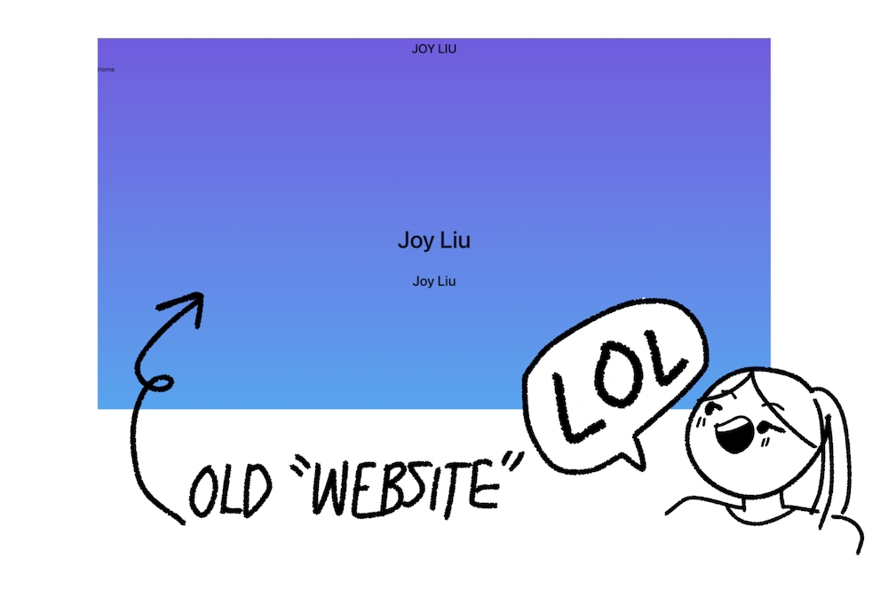
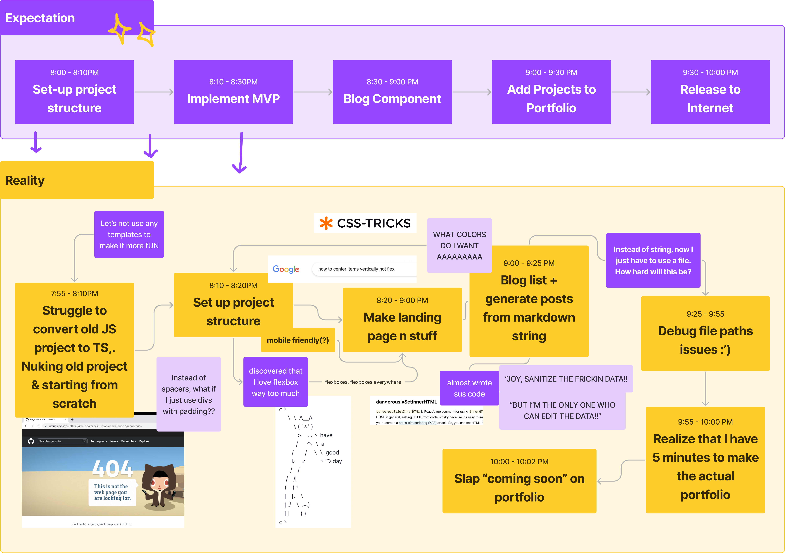

Last night, mid-conversation with a friend, I suddenly decided to dedicate the rest of my evening creating a personal website from scratch.

I have been meaning to make a portfolio website for a while but never got around to doing it. In fact, I bought the domain *nearly two years ago*, and for two years, the website looked like this:

Beginning with my gap year and ending with the start of college, this project rested at the back of my mind... until last night.

# Two Hour Sprint: The Challenge
I roped in my friend into a **coding sprint**, where for the next 2 hours, we each have to make a personal website with the following requirements:

### 1. The project is graded on *completion*, not quality
The biggest blocker for making a website is getting started. Once you have it up and running, you can always make improvements. 

### 2. At the start of 2 hours, come up with a list of features for the MVP

Regardless of how pretty it looks, we have to implement all of the following within 2 hours:

## Necessary features
- **Landing page**
- **List of projects** that we've done.
- **Blog page** that renders markdown

> **What is MVP?**
MVP, or *Minimal Viable Product*, is the set of features that constitute the bare minimum of your project. For example, I really want to animate a flying airplane for the landing page, but is it really necessary for my website to function? Not really. A navbar, on the other hand? Kind of important.
>
> MVPs are good because they help you narrow down the necessary components of your components and save time. Also, it helps with the planning fallacy, (which I will discuss later).

# How it went
This is the part where I tell you that you've been click-baited by the title. I didn't make it in 2 hours. 

Instead, it took **2 hours to sprint, 1 hour to clean-up, and 1 more hour to debug**. That's **4 hours in total** and twice as much as the original anticipated time. Moreover, I'm still not done with the portfolio page.

## What happened
Coming into this, I had a strong sense of confidence. From 2020-2021, I competed in 12 hackathons, developed a lot of projects (both work-wise and on the side), and I felt pretty good about my ability to produce code on a time-crunch. 

# Take-aways
I grew pretty interested in decision theory over the past year, and this is a good example of the topics I learned.

## Take-away 1: Use templates & external resources!
In a way, I was blindsighted by my own experience. Because of this, I made some decisions that ended up pretty time-costly:
- Not using a template
- Writing it in React instead of static site

Also, there is an imperfect correlation between programming experience & speed!

> If you want to make a simple personal website, I would highly recommend using a template! It's fun to design things on your own, but implementing them *and doing it well* takes a good amount of time/experience.

## Takeaway 2: Hofstadter's law/Planning Fallacy
This is also a pretty fun example of Hofstadter's law, where things will always take longer than we think they will. 

Hofstadter's law is why things like MVP are useful. You can make this great plan about all the amazing things you are going to add, but at the end of the day, you may not finish on time. When you don't, at least you would have finished the necessary components first so that your project is ready to be shown (like now)!

## Take-away 3: Sprints are super effective
In this case, I finished and uploaded *something* to the internet, and honestly that's all that matters. If this sprint never happened, who knows how much longer it would have taken me?

Sprints are useful when the details of what needs to be made are planned, a specific deadline is set, and you are okay with working on it a little more after. Bonus points if you do it with other people (but work on individual projects) so it's more fun!

### Sprints vs Hackathons
Both of them are about working on a project under a deadline. However, sprints are usually solo projects that *advances* a project for next time rather than a hackathon, which requires you to *complete* it. 

In hackathons, working on a project after submission ends and before the event is over is not allowed. As a result, there's often pressure to prioritize functional code over robust framework. That mindset and habit is something I had to unlearn in the past year and a half.

When I was working on this sprint, I was in a different mindset. Because my website is something that I will continue to update and use over the years, I was focused on writing good code, even when I was on a time crunch.

Fortunately, I was pleasantly surprised by how I was still able to retain the ability to develop quickly from my hackathon experiences but also be cognisant of good engineering design. For example, I sectioned the project in a way that is organized, which also ended up saving time. It was also easy to avoid shortcuts that seemed unsafe gut-instinct-wise. 

In future hackathons/projects, the ability to write quick production quality code is something that I now feel more confident about and plan on carrying through. 

### Move fast, but don't break things
At first, moving fast and developing well may seem like they conflict with each other. However, at its core, this stems from inexperience. Moreover, for projects that are more long term, moving fast can often lead to slower development in the future.

# Future Improvements
I will be improving this site in the future if I have time! For now, I will be putting web-dev on pause. In the future, I want to add the following:

### Portfolio
Add the projects that I worked on in a visually appealing way. 

### More Automated Blog Generation
So far, my workflow for adding blog-posts seem alright, but I think it can be even more automated. For example, it might be cool to grab metadata (title/date/last-updated) from the markdown file and Github directly!

### Styling Nits
Fix background image, add cool animations, and random things that actually justify why I'm making my website using React & Typescript, other than the fact that I like React & Typescript. I also want to refactor some of this, such as the blog component (maybe rendering the HTML at compile time as opposed to fetching at runtime).

### Write more blogs!
Aside from a post last year about [my GSoC experience](https://coda.io/@joy/2021-gsoc-story), this is actually my first blog post in... well... ever! In the future, I hope to write more blogs.

# Thanks, and have a good day :D