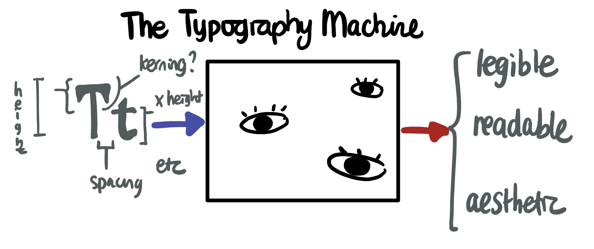
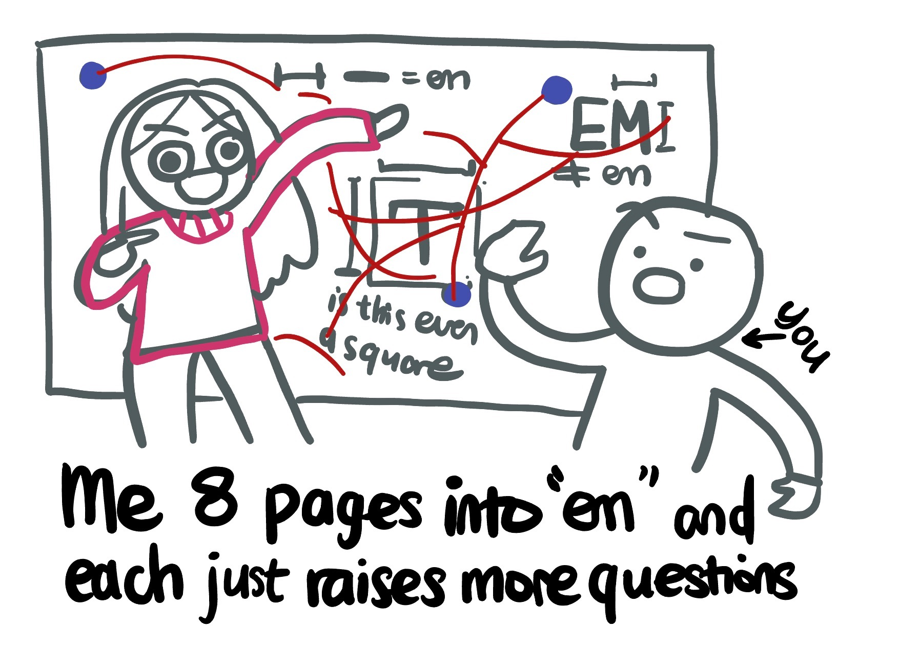
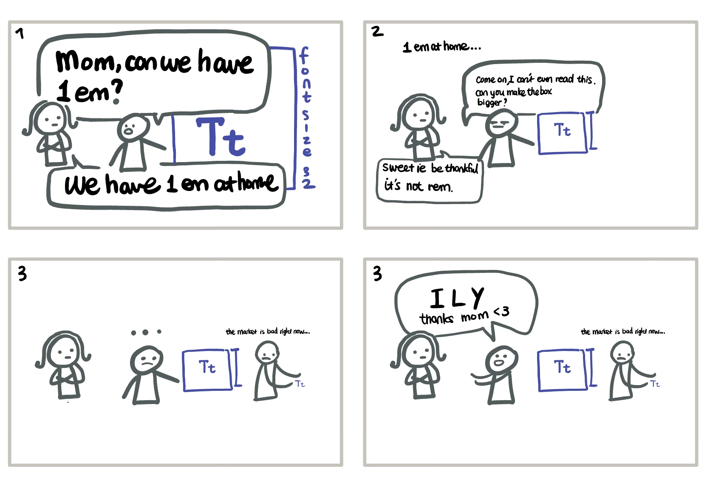
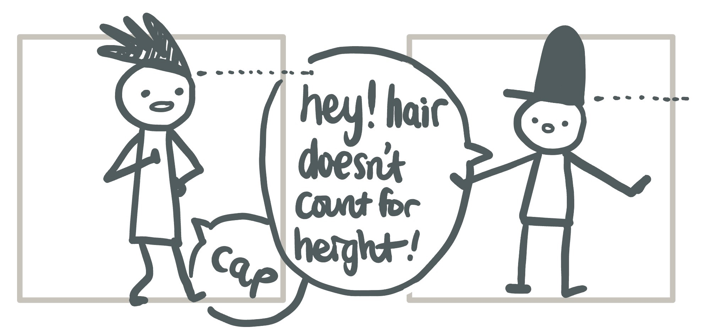

# Brief Dive into Typography
*4pm - 5:30pm, February 25th, 2024.*

I've always had opinions on fonts, whether it is customizing my terminal, icking over Times New Roman for assignments, or choosing a font for my website. However, when people ask me what I like or dislike about a certain font, I never knew what to say. "I like how it's... round?" or "I don't like the 'g'" are not very helpful critiques.

Today, at a rabbithole/deep dive event, I decided to learn how to systematically analyze fonts so I can sound more ~pretentious~ (jk) and actually have informed opinions.

This blog post is a record of my learning and divided into two parts.
1. Summarizing my learnings in fonts and typography.
2. Applying my noob knowledge, where I try to explain my favorite fonts related to web development and why. I will also see if learning more about fonts changes my favorite font choices.

Additionally, because this is an hour of my learning, if there's anything that is incorrect, please let me know! I would love to learn more.

> Lastly, I want to preface your reading by saying I braindumped this blogpost also from 4-6pm. I will add in pictures for vibes but it may be a little stream-of-consciousness-y.

# About Typography
If Typography is a black box, it has 6 inputs that you can tweak and 3 main outputs:

- **Inputs (parameters)**: typefaces (font family), point sizes, line lengths, line spacing, letter spacing, and spaces between pairs of letters (kerning).
- **Outputs (outcome)**: legible, readable, and appealing.

## Inputs
Some inputs, like the glyph, point size, and kerning, are controllable by the font itself. Others, like line-length and line spacing, are more in the hands of the developer or designer.

> **What's a glyph (pronounced `glif`)?**: A glyph is the shape of a character. For example, the letter "a" has two glyphs: one for uppercase and one for lowercase. Fonts also have superfamilies, which are like `PT Serif` and `PT Sans`.

> **Line spacing vs letter spacing**: line spacing, or also called leading, is the vertical space between lines. More leading, intuitively, increases readability. Letter spacing is the horizontal space between individual symbols.

### Em
At this point diving into line spacing, line height, and letter spacing, I rediscovered `em`. As a web developer, I remember seeing `em` for font sizes, but I never actively chose to use it or knew what it meant.

As it turns out, `em` stands for the width of the "M" in that typeface, and it's used to measure the size of the font.

`em` relates to a parameter in the font called the "em square", which is a square that is used to measure the size of the font.

> 
> *Em? More like E(I)m confused. HaHaAHa*

At this point, I got confused. I know that font has "point sizes", for example, 12 point Times New Roman. How do they relate to `em`? Is it a standard measure for all fonts?

That's when I discovered something more shocking.

As it turns out, a typeface can be "set" in a particular font size (e.g. 16px), and from that point forward, one `em` in that typeface is "16px".

Confused? I was too. Let me explain.

Let's say you have a parent container where the font size is set to 16px. If you set the font size of a child element to 2em, the font size of the child element will be 32px. If you set the font size of a child element to 0.5em, the font size of the child element will be 8px.

By default, most HTML text has a font size of 16px, so if you set the font size of a child element to 1em, the font size of the child element will be 16px.

You know what's even crazier? At this point, `em` doesn't even have to be the width of the "M" in that typeface. It can be anything. It's just a standard measure for that typeface.

There's also something called `rem`, which is `em` but relative to the *root* element.

### Em Square
Ok, so Em is something that is more catered to web development, but what about the "em square" that I mentioned earlier?

The em square is a square box that is used to measure the relative sizing of each glyph in a font. 

Although it's called a square, the height of the em square typically is the one that defines the point size. The width of the em square is used to measure the relative sizing of each glyph in a font.

With the em square, we can now define a few more terms.

### X-height

**X-height** is the height of lowercase letters relative to the "em square". Larger x-heights improve readability. X-heights are also why sometimes your text looks smaller after you change the font.

### Cap-height
**Cap-height** is the height of capital letters relative to the "em square". Not all capital letters are the same height, and the cap-height is the height of the tallest capital letter in the font. Note that in serif fonts (curly fonts that look like Times New Roman), the cap-height only counts the flat tops, not the little triangular serif extension embellishment thingies.

### Kerning
**Spaces between pairs of letters (kerning)**: sometimes, in addition to letter spacing, you can sometimes have letters overlap in space (e.g. AV). Negative kerning can be used in capital letters such as `T` to make it squish a little bit to the left of where the symbol would have been placed otherwise, and positive kerning is used in lower case letters such as `f)`.

There are also a bunch of other ways fonts can be varied, but these are the main ones I looked into. Overall, they are a bunch of optical illusions that make the text look better.

## Outputs
Text can be assessed on the following 3 characteristics:

### Legible vs Readable
Legible: how recognizable vs distinguishable the different characters are from one another.
Readable: is a block of text effortless to read. Typically important for large blocks of text. Have you ever scanned across a paragraph and realized you have no idea what you just read? Maybe that's ~the font's fault~ :P

### Appealing
Self explanatory, I think. But what is uncertain is how to qualify what makes different fonts appealing.

# Hot(?) Font Takes from a Noob
Great, so obviously at this point I know everything there is to know about fonts.

Now, I'm going to take my noobish knowledge and apply them to explain my favorite fonts and why.

Note that I had 15 minutes to write these out and they are kind of brain-dumpy. I will revisit this later and see if my opinions change.

## Terminal Font: Noto Sans Mono
I used Noto Nerd Font for my terminal, which stems from Noto Sans Mono. Because of my limited knowledge, it's hard for me to directly say based off of a number (e.g. "500 x-height, that must mean it's teRriBLe"), so I will do a relative comparison to my friend's font, which is Victor Mono.

Both are sans serif (without serif) without kerning because monospaced fonts typically do not have kerning.

Noto Nerd Font has a lower x-height, so it's less readable from that regard. However, its letters are much wider, and also less similar to each other which means it has higher legibility.

Overall, I'm semi-satisfied with Noto Sans Mono and think it's more aesthetic than Victor Mono, but am still open to other terminal font suggestions.

## Cute Display Font: Quicksand
I've known Quicksand since 2021 and think it's so *cute* because it is so... round. It is a display font, which means it is used for large text, and I think it's appealing because it's so round and friendly. It's also sans-serif, which I think is more modern and clean.

I also stalked their [github](https://github.com/andrew-paglinawan/QuicksandFamily) and in the changelogs it says "improved kerning" and now I know what that means! I think that's cool. I also stalked their GitHub that said their x-height increased from 500 to 515, and that means it is more readable in smaller font sizes.

The one caveat is that this font has less variability in its glyphs, so it's more consistent looking but less legible.

## Paragraph Text Font: Inter
GitHub likes it, and I like it too. It is very similar because Inter is backfilled from Roboto, which means it's similar but with some improvements. One of the similarities intentionally copied over is the x-height to cap-height ratio, which is 3/4th. This means that the x-height is 3/4th the cap height, which is a good ratio for readability.

However, Inter makes the font much less condensed, making it more readable but take up a bit more space horizontally. Overall, Inter can be classified as geometric neo-grotesque, which means it's a sans-serif font that is more modern and clean. Dissecting the name, "neo-grotesque" means it's a sans-serif font that is more modern and clean, and "geometric" means it's more round and friendly.

## Conclusion
I like "round and friendly" fonts like Inter and Quicksand, and that's my personal aesthetic. I now can also realize why sometimes my writing seems to shrink or expand, as well as "look smaller" because of x-height and kerning.

# Interesting asides
### David Carson
I discovered experimental typefaces such as [David Carson](https://eyeondesign.aiga.org/anti-grid-icon-david-carson-on-why-computers-make-you-lazy-and-indie-mag-design-needs-to-liven-up/) and Ray Gun, which felt very exhilarating to look at for someone who felt like they've been designing and developing too much by the rules. Seeing the same tailwind template over and over again on company splashpages, and working with repetitive designs, it was a breath of fresh air and quite inspiring, and I want to be inspired by that kind of aesthetic when I revamp my personal portfolio website.

### Oblique Fonts
When a font has commitment issues and haven't decided if it's italically slanted or not.

### Ragged Right
When text starts on the left and leaves off random chunks of whitespace on the right side.

## Future Investigations
**Google font how?**: I also want to look into how does a font get added to Google Fonts. When looking into particular fonts, I realized that a lot of fonts have GitHub repositories, and PRs/issues related to it being added to Google Fonts. I want to learn more about the life of a font :D

**Accessibility in Typography**: I also want to look into how typography can be used to make text more accessible, both in terms of expanding fonts to other non-english symbols and accessibility in general for people with disabilities.

# References
- https://en.wikipedia.org/wiki/Typography
- https://fonts.google.com/knowledge/glossary/em
- https://fonts.google.com/knowledge/choosing_type/exploring_x_height_the_em_square
- https://www.smashingmagazine.com/2014/09/balancing-line-length-font-size-responsive-web-design/
- https://www.figma.com/blog/the-birth-of-inter/#:~:text=Inter%20has%20a%20relative%20x,3%2F4th%20the%20cap%20height.
- https://en.wikipedia.org/wiki/Oblique_type
- https://fonts.google.com/knowledge/glossary/oblique

# Future References
These are articles I didn't have the time to explore but think would be cool to read:
- https://fonts.google.com/knowledge/glossary/ascenders_descenders
- Accessibility in typography
- https://www.creativebloq.com/typography/examples-kinetic-typography-11121304